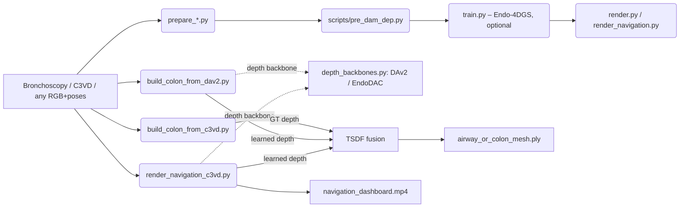

# 3DEndoMap — Surgical Navigation GPS for Endoscopy

3DEndoMap turns a monocular endoscopic video into a live **surgical
navigation dashboard**: the camera's position inside the organ, a 3D
map of inspected anatomy, and clinical metrics (procedure time,
withdrawal speed, coverage percentage) composited into a single MP4.

> **Primary target: bronchoscopy.** The project pivoted from
> colonoscopy (C3VD) to **bronchoscopy** because the airway tree is
> *rigid* (cartilage rings prevent deformation), *branching*
> (carinas give natural SLAM landmarks), *shorter* (5–15 min vs
> 20–60), and *CT-based pre-op planning is universal* — every patient
> has an airway CT, which maps perfectly onto the existing
> `--reveal_organ` mode. Colonoscopy is harder on every axis (long
> deformable tube, low texture, peristalsis) and stays as a
> secondary / legacy code path.

The project began as a fork of **Endo-4DGS** (MICCAI 2024) for 4D
Gaussian Splatting reconstruction, then grew into a standalone
pipeline that:

- ingests endoscopy data (bronchoscopy primary, colonoscopy legacy
  via the C3VD path) — RGB + per-frame poses, optionally with GT
  depth and a pre-operative CT mesh,
- runs an off-the-shelf **monocular depth backbone** (EndoDAC, the
  endoscopy-specific depth model from MICCAI 2024 — or DAv2 as a
  generic fallback),
- fuses depth + poses into a **growing 3D mesh** of the airway / organ
  via TSDF, and / or uses a pre-operative CT mesh painted in by the
  camera's frustum, and
- composites everything onto a clinician-style dashboard.

**Full project scope** (today + planned):
The end goal is a clinician-facing tool that, given just a live
bronchoscopic video, shows (1) **where** the scope is in the airway
tree, (2) **what** is in front of it (lobar landmarks, lesions,
biopsy tools, bleeding — auto-segmented), (3) **which segments**
have been inspected vs. missed, and (4) **how trustworthy** every
ML-derived overlay is. Today only 1 + 3 are implemented (on phantom
data with GT poses). The roadmap adds monocular SLAM (drops the
GT-pose requirement), online 4D Gaussian fusion, anatomical shape
priors, **per-frame semantic segmentation overlays**, and a
**calibrated confidence / trust layer** that surfaces "how much to
rely on this" alongside every ML output — the safety property that
separates a research demo from a clinical tool.

> Status. **Research-grade demo on phantom data.** End-to-end works
> on C3VD (colon phantom) today because C3VD ships ground-truth
> poses and an exact CT mesh. The bronchoscopy port reuses ~90% of
> the code; the missing 10% is dataset prep + a bronchoscopy-tuned
> hFOV. See the **Bronchoscopy port** section below and the
> **Roadmap** for what's needed beyond the phantom demo.

---

## 1. What works today

| Capability | Module | Status |
|---|---|---|
| C3VD → EndoNeRF data prep (correct hFOV, mask convention, near/far) | `prepare_c3vd.py` | ✓ |
| Endo-4DGS training & rendering (legacy path) | `train.py`, `render.py` | works on EndoNeRF; on C3VD needs careful tuning |
| Depth-Anything pseudo-depth generator | `scripts/pre_dam_dep.py` | ✓ |
| **TSDF fusion from C3VD GT depth + poses** | `build_colon_from_c3vd.py` | ✓ ICP fitness 0.64 vs phantom |
| **Pluggable monocular depth backbones** | `depth_backbones.py`, `dav2_depth.py` | DAv2 + EndoDAC |
| **TSDF fusion from learned depth + GT poses** | `build_colon_from_dav2.py` | ✓ EndoDAC achieves ICP fitness 0.66 vs phantom (beats GT-depth) |
| **Standalone surgical-GPS dashboard** | `render_navigation_c3vd.py` | ✓ Three modes: `coverage`, `reveal`, `dynamic` |
| Endo-4DGS-based dashboard (older) | `render_navigation.py` | works when the trained Gaussian model is converged |
| Trajectory ↔ organ-mesh ICP alignment | `_align_trajectory_to_organ` in `render_navigation_c3vd.py` | ✓ |
| Coverage heatmap + reveal-as-you-go + live TSDF growth | dashboard | ✓ |
| Withdrawal-time / pullback-speed HUD | `dashboard_common.py:draw_hud` | ✓ |

### Architecture



The same code path serves both bronchoscopy and colonoscopy — only
the dataset-prep script and pre-op organ mesh change.

---

## 2. Bronchoscopy port (primary target — work in progress)

**Why bronchoscopy first.** Of the endoscopy procedures we considered
(colon, bronchi, sinonasal, upper-GI, hysteroscopy, arthroscopy), the
airways are the easiest to reconstruct accurately:

| Property | Bronchoscopy | Colonoscopy | Why it matters |
|---|---|---|---|
| Tissue rigidity | rigid (cartilage rings) | deformable (peristalsis, scope pressure) | TSDF / SLAM averaging works |
| Topology | branching tree | long curved tube | branch points = SLAM landmarks + loop closure |
| Texture | vascular pattern + cartilage ridges | low-texture mucosa | feature matching is reliable |
| Procedure length | 5–15 min | 20–60 min | smaller datasets, faster iteration |
| Pre-op CT | universal (every chest CT shows airways) | rare for screening | `--reveal_organ` mode gets a real prior per patient |
| Public datasets | EndoMapper-Bronchus, BREAD phantom, IRCAD | C3VD, Kvasir, EndoMapper-Colon | comparable availability |

**What needs to change in the codebase (~90% reusable):**

| Module | Change required |
|---|---|
| `prepare_c3vd.py` | Fork into `prepare_bronchus.py` for the new dataset's pose/depth format. Trivial — same shape. |
| `prepare_*.py` defaults | hFOV ~90° (bronchoscopes), not 140° (colonoscopes). |
| `arguments/c3vd.py` | New `arguments/bronchus.py` for any tuning (probably identical at first). |
| `_pose_to_organ_space` | Re-derive the rotation between dataset-pose-frame and the bronchial-tree CT mesh via a one-off `check_alignment.py` sweep. |
| `dataset/trans_model.obj` | Replace with a bronchial-tree mesh (segmented airway from a chest CT). |
| `render_navigation_c3vd.py` | **No code change.** Pass `--c3vd_dir <bronchus_dataset> --organ_mesh <airway_tree.ply>` and it works. |
| Everything else | unchanged: `depth_backbones.py`, EndoDAC, `dynamic_organ.py`, `dashboard_common.py`, `check_alignment.py`. |

**Open tasks for the bronchoscopy port (in priority order):**

1. **Dataset acquisition** — pick one of EndoMapper-Bronchus,
   BREAD phantom, or a private clinical clip. Need RGB + poses
   (phantom → external tracker; clinical → SLAM, see Phase 1).
2. **Airway-tree CT segmentation** — pull a chest CT, segment the
   bronchial lumen (3D Slicer + the `Lung CT Analyzer` extension or
   the `pulmo3D` package). Export as `.ply` / `.obj`.
3. **Write `prepare_bronchus.py`** mirroring `prepare_c3vd.py`.
4. **Tune `--hfov 90`** and run the existing dashboard pipeline.
5. **Verify with `check_alignment.py`** against the segmented airway.

Effort: ~1 week for the first end-to-end demo with a phantom
sequence (mostly dataset wrangling, not code).

---

## 3. End-to-end on C3VD (legacy / colonoscopy reference path)

```bash
# 0. Install
conda create -n ED4DGS python=3.8 && conda activate ED4DGS
pip install -r requirements.txt
pip install torch==2.0.0 torchvision==0.15.1 torchaudio==2.0.1 \
    --index-url https://download.pytorch.org/whl/cu118
pip install -e submodules/diff-gaussian-rasterization-depth
pip install -e submodules/simple-knn

# 1. Set up EndoDAC (one-time, ~800 MB downloads)
git clone https://github.com/BeileiCui/EndoDAC.git external/EndoDAC
cd external/EndoDAC && pip install fvcore timm einops && cd ../..
# Backbone (one .pth)  → external/EndoDAC/pretrained_model/depth_anything_vitb14.pth
#   https://drive.google.com/file/d/163ILZcnz_-IUoIgy1UF_r7PAQBqgDbll
# Adapter (folder)     → external/EndoDAC/EndoDAC_fullmodel/depth_model.pth
#   https://drive.google.com/file/d/1qzAYBtwYJDN7hEi6pApqBOOz6pUhyY70

# 2. Run the dashboard — three modes, no Endo-4DGS training required
python render_navigation_c3vd.py \
    --c3vd_dir dataset/trans_t1_b \
    --output_dir output/c3vd_dash_reveal \
    --backbone endodac \
    --endodac_repo external/EndoDAC \
    --endodac_weights external/EndoDAC/EndoDAC_fullmodel/depth_model.pth \
    --organ_mesh dataset/trans_model.obj \
    --mode reveal     # also: coverage  |  dynamic
```

**What you get:**
- `navigation_dashboard.mp4` — composited per-frame video (1769×896 by default)
- `dashboard_frames/frame_*.png` — one keyframe every ~5%
- `dynamic_organ_mesh.ply` (dynamic mode only) — final fused mesh

**HUD:**
- `Withdrawal MM:SS` (target ≥ 6:00 per colonoscopy guidelines, color-coded)
- `Speed mm/s` (1–6 mm/s green, otherwise red)
- `Path mm` cumulative
- `Revealed % | Coverage % | Mesh NN,NNN pts` depending on mode

### Verifying a fused mesh

```bash
python check_alignment.py \
    --ours output/c3vd_dash_dynamic/dynamic_organ_mesh.ply \
    --gt   dataset/trans_model.obj
```
Sweeps 32 axis conventions + ICP, reports top-5 fitness. EndoDAC + GT
poses currently scores ~0.66 on `trans_t1_b`.

---

## 4. Repo layout

```
prepare_c3vd.py             C3VD → EndoNeRF format
scripts/pre_dam_dep.py      Depth-Anything pseudo-depth generator

train.py / render.py        Endo-4DGS training + offline rendering (legacy)

# Surface + organ reconstruction
build_colon_from_c3vd.py    TSDF fusion from C3VD GT depth + poses
build_colon_from_dav2.py    TSDF fusion from learned depth (DAv2 / EndoDAC) + poses
dynamic_organ.py            Open3D ScalableTSDFVolume wrapper
check_alignment.py          ICP sweep against a GT mesh

# Depth backbones
depth_backbones.py          Pluggable backbone interface (DAv2 / EndoDAC)
dav2_depth.py               Hugging Face Depth-Anything-V2 wrapper

# Dashboards
render_navigation_c3vd.py   Standalone C3VD dashboard (recommended path)
render_navigation.py        Endo-4DGS-based dashboard (needs trained model)
dashboard_common.py         Shared GPS panel, depth viz, HUD helpers

# Plus the full Endo-4DGS infrastructure inherited from upstream
arguments/  scene/  gaussian_renderer/  utils/  submodules/
```

---

## 5. Honest assessment — does it work for a real surgeon?

**No.** Not yet. The C3VD demo works because C3VD provides:

1. **Perfect ground-truth camera poses** from an external optical tracker.
2. **An exact CT mesh** of the same physical phantom the camera moves through.
3. **Static, rigid, non-deforming anatomy.**

In the operating room, all three vanish:
- A real colonoscope has no external tracker.
- The pre-operative CT is days/weeks old, of a deformed organ.
- Tissue moves with peristalsis and scope pressure.

What we have today is the right **scaffold** — depth backbone, fusion,
visualization, and HUD all work — but several large research components
are still missing before this is clinically useful.

---

## 6. Roadmap to a clinical tool

The list below is ordered by build cost. Each phase produces a working
demo at the end; each unlocks the next.

### Phase 0 (current state)
- Static EndoDAC depth → C3VD GT poses → TSDF / pre-op CT reveal.
- Useful as a teaching tool, demo, and integration shell. Not clinical.

### Phase 1 — Drop the GT-pose dependency: monocular SLAM
- **Replace `pose.txt` with live visual odometry.** Bronchoscopy-first
  is a major win here: branching airways give the SLAM matcher
  natural landmarks (carinas) and built-in loop closures every time
  the scope passes a bifurcation, instead of the long, low-texture
  drift you get in a colon.
- **SOTA option (best fit):** **Endo-2DTAM** — Gaussian-Splatting SLAM
  for endoscopic scenes (the same authors as Endo-4DGS).
  https://github.com/lastbasket/Endo-2DTAM
- **Alternates:** DROID-SLAM, ORB-SLAM3, MonoGS / RTG-SLAM. All
  general-purpose; expect drift on long featureless tubes — but the
  airway tree is *not* featureless, so even the general-purpose
  systems should converge on bronchoscopy without much tuning.
- **Bronchoscopy-specific helpers worth adding:**
  - **Branch-point detection** in 2D (carinas are visually
    distinctive) → strong relocalization anchors.
  - **CT-airway-tree matching** — once we know the topological
    sequence of branches the camera passed, snap to the segmented
    airway from the patient's CT (best of monocular SLAM + CT prior).
- **Deliverable:** dashboard works on a sequence with **only RGB**,
  poses estimated live. Acceptance: trajectory ICP fitness ≥ 0.5
  vs ground-truth poses on a phantom bronchus run.
- **Effort:** 3–5 weeks (less than colon because of the branch
  landmarks).

### Phase 2 — Drop the static-TSDF assumption: online Gaussian fusion
- **Replace `Open3D.ScalableTSDFVolume` with an online 3D Gaussian
  Splatting map** that grows / refines per frame instead of
  averaging discrete voxels.
- **SOTA options:**
  - **MonoGS** (CVPR 2024) — monocular GS-SLAM with live map.
  - **RTG-SLAM** (SIGGRAPH 2024) — real-time GS-SLAM on a single GPU.
  - Or extend Endo-2DTAM's GS map directly.
- **Deliverable:** the `dynamic` dashboard mode renders smooth 3DGS
  splats in place of voxel mesh; sub-mm local detail.
- **Effort:** 4–8 weeks; needs GPU at inference (≥ 16 GB VRAM).

### Phase 3 — Drop the exact-mesh assumption: anatomical shape prior

> **Bronchoscopy advantage:** every patient already has a chest CT,
> so the **patient-specific CT prior (3.1)** is the realistic clinical
> default — no SSM dataset wrangling needed. The harder Phase 3.2 / 3.3
> options stay relevant for colonoscopy (where pre-op CT is rare for
> screening) and for handling deformation.

- **Add a Statistical Shape Model (SSM) of the colon as a soft
  Bayesian prior.** Where the camera has seen tissue → trust the
  reconstruction; where it hasn't → fall back to the prior with a
  visible **uncertainty channel** (translucent / hatched in the GPS
  panel).
- **Approaches, ranked by clinical safety:**
  1. **Patient-specific pre-op CT segmentation as the prior**
     (requires a CT per patient; safest because the prior is
     literally the patient's anatomy).
  2. **PCA-based SSM** trained on a colon-population dataset
     (smooth, deterministic, conservative — the preferred
     research-grade path).
  3. **Generative diffusion / NeRF prior** (most expressive,
     **most dangerous** clinically because it hallucinates
     plausible-looking pockets that may not exist).
- **SOTA references:**
  - **ColonNeRF** (ICCV 2023 W) — neural colon shape prior.
  - **AnatomyDiff** family — diffusion priors for organs.
  - **OrganMNIST / classical SSM toolkits** for the PCA path.
- **Deliverable:** organ surface beyond the camera frustum is
  filled in by the prior, with a colored uncertainty overlay
  (e.g. low-α teal = predicted, opaque pink = observed).
- **Effort:** 6–12 weeks for #1, 3+ months for #2, research project for #3.

### Phase 4 — Drop the rigid-organ assumption: deformable / 4D model
- **Tissue deforms** under scope pressure and peristalsis. A static
  fused mesh smears those changes away.
- **Approach:** time-aware 4D Gaussians (Endo-4DGS already supports
  this offline) integrated with the online SLAM map.
- **SOTA references:** Endo-4DGS (offline), Deformable-3DGS
  (CVPR 2024), 4DGS variants.
- **Deliverable:** GPS panel shows organ shape *changing* over time,
  not just growing.
- **Effort:** research project; expected at the end of this roadmap.

### Phase 5 — Per-frame semantic segmentation overlays
- **What:** add a pluggable **segmentation backbone** (mirroring
  `depth_backbones.py`) that produces per-pixel masks for clinically
  relevant classes. Class set is procedure-specific:
  - **Bronchoscopy (primary):** lumen / carina (branch point) /
    bronchial generation level (1°, 2°, 3°…) / lesion or nodule /
    biopsy tool / blood / mucus / image quality.
  - **Colonoscopy (legacy):** polyps / anatomy landmarks
    (lumen / haustra / ileocecal valve) / surgical tools / bleeding /
    image quality (clear / bubbles / stool / blur).
- **Where it shows up:**
  1. **Endo panel**: colored translucent masks overlaid on the live
     frame.
  2. **3D map**: back-project mask centroids through depth + pose
     onto the organ surface — polyps become persistent 3D markers
     you can revisit.
  3. **HUD**: per-finding counters ("polyps detected: 3"), and an
     image-quality % that drives the existing withdrawal-quality
     metric.
- **SOTA options (off-the-shelf, no training):**
  - **SAM2 / SAM2-Video** (Meta, 2024) — class-agnostic, prompt-trackable across frames.
  - **MedSAM** (Nature 2024) — medical-tuned SAM.
  - **Polyp-PVT / FCBFormer / TransNetR** — colonoscopy polyp segmentation.
  - **Surgical-SAM** family — surgical-tool segmentation.
- **Deliverable:** dashboard with a fourth "findings" overlay; every
  mask clickable to a 3D location; report at the end listing all
  flagged findings with thumbnails + GPS positions.
- **Effort:** ~250 LOC for SAM2 + a polyp head, ~6 hours integration.
  Calibrating against a labeled dataset (Kvasir-SEG, CVC-ClinicDB) is
  another 2–3 days for evaluation.

### Phase 6 — Calibrated confidence / trust layer
- **Why:** stock NN confidences are overconfident. A clinical tool
  needs every ML-derived overlay to come with a defensible
  "trust this how much?" signal. This phase adds a **unified
  uncertainty channel** spanning depth, segmentation, pose, mesh,
  and (eventually) the SSM prior.
- **Per-output uncertainty sources:**
  - **Depth (EndoDAC / DAv2):** test-time augmentation variance
    (predict 4× with horizontal flip / brightness jitter, take
    per-pixel std-dev). Already available in `depth_backbones.py`
    interface — needs a `predict_with_uncertainty()` method.
  - **Segmentation:** sigmoid logit margin per pixel; MC-dropout
    when the backbone supports it.
  - **Pose (SLAM):** inlier ratio + reprojection error from the
    matcher.
  - **TSDF mesh:** voxel weight (Open3D already tracks how many
    frames touched each voxel).
  - **Coverage / reveal:** number of frustum hits per vertex
    (already computed; just expose).
- **Calibration to make confidences honest:**
  - **Temperature scaling** on a held-out set (~5 LOC).
  - **Conformal prediction** for actual coverage guarantees
    ("90% of pixels are within ±N mm at this confidence").
  - **Deep ensembles / MC-dropout** where the backbone supports it.
- **How it surfaces on the dashboard:**
  1. **Translucency / hatching:** high-confidence regions opaque,
     low-confidence translucent or hatched, on every overlay
     (mask, mesh, coverage, reveal, predicted-from-prior regions).
  2. **Dedicated uncertainty panel:** grayscale heatmap, dark = trust,
     bright = doubt, sitting beside the depth panel.
  3. **HUD numbers:** "Mean depth uncertainty: 2.3 mm",
     "Polyp confidence: 0.78", "Pose drift: 1.2 mm/frame".
  4. **Alert thresholds:** popup when confidence drops below a
     threshold (obscured frame, occluded region, tracker lost).
- **Deliverable:** every overlay on the dashboard answers
  "how much should the surgeon believe this?" without requiring
  ML literacy. Same module is reused by phase 3's anatomical-prior
  uncertainty channel.
- **Effort:** ~250 LOC for the confidence interface + per-backbone
  hooks + dashboard rendering, ~6 hours of integration. Adding
  conformal prediction with a real labeled set: +1 week.

### Phase 7 — Clinical UI on top
- Bookmark / export findings (PDF report with thumbnails + 3D
  positions, exportable per-procedure).
- Withdrawal-quality scorecard (time, speed, coverage, missed
  regions, image-quality %).
- Missed-region alerts in real time ("you didn't look at the cecum
  for 90 s").
- Polyp size measurements via depth (click two points, report mm).
- Replay mode for case review with full overlays + uncertainties.
- **Effort:** 6+ weeks; minimum viable scorecard can land in 2.

### Suggested team / parallelism

| Phase | Can start immediately | Blocks on |
|---|---|---|
| 1 (SLAM)                  | yes | — |
| 2 (online 3DGS)           | yes | — |
| 3.1 (CT prior)            | yes | — |
| 3.2 (SSM)                 | yes (data work) | colon dataset |
| 3.3 (diffusion)           | yes (research) | — |
| 4 (4D)                    | partial | phase 2 |
| 5 (segmentation overlays) | yes | — |
| 6 (confidence / trust)    | yes | works best after 5 + 1 + 3 |
| 7 (clinical UI)           | yes | strongest after 5 + 6 |

A 3-person split would be: **SLAM + 4D lead** (phases 1 + 2 + 4),
**Anatomical-prior + segmentation lead** (phases 3 + 5),
**Confidence + clinical-UI lead** (phases 6 + 7). Phases 5 and 6
together are what turn the demo from "shows organ shape" into
"shows organ shape, what's in it, and how much to trust either" —
they're the highest clinical-value pair on this list.

---

## 7. Datasets

**Primary (bronchoscopy):**
- **EndoMapper** (Cogan et al.) — multi-procedure clinical endoscopy
  collection including bronchoscopy clips with intrinsics. Apply
  through the EndoMapper portal.
- **BREAD bronchoscopy phantom** (Sganga et al.) — silicone airway
  phantom with synchronized RGB + tracker poses. Public.
- **IRCAD bronchoscopy** — phantom + cadaver clips, request-based.
- **Patient-specific airway CT** — required for `--reveal_organ`
  mode. Segment with **3D Slicer + Lung CT Analyzer** or
  **pulmo3D**, export `.ply` / `.obj`. Use this even for phantom
  runs by scanning the phantom itself.

**Legacy (colonoscopy / general endoscopy):**
- **C3VD** colon phantom — prep with `prepare_c3vd.py`
  (defaults: hFOV ≈ 140°, the wide-FOV Olympus colonoscope).
- **EndoNeRF** — train via Endo-4DGS as documented in the original
  paper. Use `arguments/endonerf.py`.
- **StereoMIS** — run `prepare_stereomis.sh`, then standard
  Endo-4DGS training via `arguments/stereomis.py`.

---

## 8. Troubleshooting

| Symptom | Likely cause | Fix |
|---|---|---|
| `Loss=0 / PSNR=inf` during Endo-4DGS training | All-white masks getting inverted to all-zero | `prepare_c3vd.py` now writes black masks; re-prep + retrain |
| Renders are noise / pixel-gradient depth | hFOV wrong | use `--hfov 140` in `prepare_c3vd.py`, retrain |
| `Revealed 0.0%` in dashboard | Trajectory not aligned to organ mesh | trajectory ICP runs by default in `render_navigation_c3vd.py`; check `Trajectory->organ ICP: fitness=...` line |
| EndoDAC dim error `not multiple of patch height 14` | Checkpoint metadata mismatched | wrapper now hardcodes 224×280 (matches `test_simple.py`) |
| `0 frames fused` with DAv2 | Metric variant predicts meters, gets clipped | use `--variant vitb` + per-frame calibration |
| ONNX `pthread_setaffinity_np` warnings | Cgroup affinity limits, harmless | ignore |

---

## 9. Citations

This work builds on:

```
@inproceedings{huang2024endo,
  title={Endo-4dgs: Endoscopic monocular scene reconstruction with 4d gaussian splatting},
  author={Huang, Yiming and Cui, Beilei and Bai, Long and Guo, Ziqi and Xu, Mengya and Islam, Mobarakol and Ren, Hongliang},
  booktitle={MICCAI},
  year={2024},
}

@inproceedings{cui2024endodac,
  title={EndoDAC: Efficient Adapting Foundation Model for Self-Supervised Endoscopic Depth Estimation},
  author={Cui, Beilei and Islam, Mobarakol and Bai, Long and Ren, Hongliang},
  booktitle={MICCAI},
  year={2024},
}

@inproceedings{depthanythingv2,
  title={Depth Anything V2},
  author={Yang, Lihe and Kang, Bingyi and Huang, Zilong and ...},
  booktitle={NeurIPS},
  year={2024},
}
```

Acknowledgements: [StereoMIS](https://arxiv.org/abs/2304.08023v1) ·
[diff-gaussian-rasterization-depth](https://github.com/leo-frank/diff-gaussian-rasterization-depth) ·
[EndoNeRF](https://github.com/med-air/EndoNeRF) ·
[4DGaussians](https://github.com/hustvl/4DGaussians) ·
[Depth-Anything-ONNX](https://github.com/fabio-sim/Depth-Anything-ONNX) ·
[Open3D](http://www.open3d.org/) ·
[Hugging Face Transformers](https://huggingface.co/docs/transformers).
