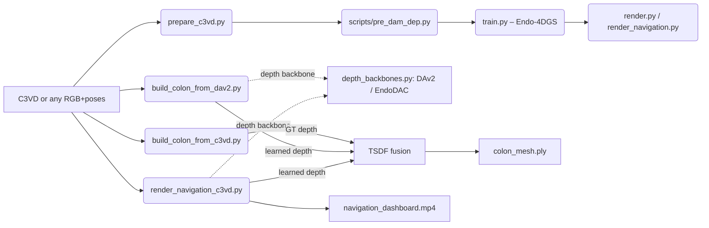

# 3DEndoMap — Surgical Navigation GPS for Endoscopy

3DEndoMap turns a monocular endoscopic video into a live **surgical
navigation dashboard**: the camera's position inside the organ, a 3D
map of inspected anatomy, and clinical metrics (withdrawal time,
pullback speed, coverage percentage) composited into a single MP4.

The project began as a fork of **Endo-4DGS** (MICCAI 2024) for 4D
Gaussian Splatting reconstruction, then grew into a standalone
pipeline that:

- ingests raw **C3VD** colonoscopy phantom data (or any sequence with
  RGB + per-frame poses),
- runs an off-the-shelf **monocular depth backbone** (EndoDAC, the
  endoscopy-specific depth model from MICCAI 2024 — or DAv2 as a
  generic fallback),
- fuses depth + poses into a **growing 3D mesh** of the organ via
  TSDF, and / or uses a pre-operative CT mesh painted in by the
  camera's frustum, and
- composites everything onto a clinician-style dashboard.

> Status. **Research-grade demo on phantom data.** It works
> end-to-end on C3VD because C3VD ships ground-truth poses and an
> exact CT mesh of the phantom. Both of those disappear in the OR;
> see the **Roadmap** for what's needed to take this clinical.

---

## 1. What works today

| Capability | Module | Status |
|---|---|---|
| C3VD → EndoNeRF data prep (correct hFOV, mask convention, near/far) | `prepare_c3vd.py` | ✓ |
| Endo-4DGS training & rendering (legacy path) | `train.py`, `render.py` | works on EndoNeRF; on C3VD needs careful tuning |
| Depth-Anything pseudo-depth generator | `scripts/pre_dam_dep.py` | ✓ |
| **TSDF fusion from C3VD GT depth + poses** | `build_colon_from_c3vd.py` | ✓ ICP fitness 0.64 vs phantom |
| **Pluggable monocular depth backbones** | `depth_backbones.py`, `dav2_depth.py` | DAv2 + EndoDAC |
| **TSDF fusion from learned depth + GT poses** | `build_colon_from_dav2.py` | ✓ EndoDAC achieves ICP fitness 0.66 vs phantom (beats GT-depth) |
| **Standalone surgical-GPS dashboard** | `render_navigation_c3vd.py` | ✓ Three modes: `coverage`, `reveal`, `dynamic` |
| Endo-4DGS-based dashboard (older) | `render_navigation.py` | works when the trained Gaussian model is converged |
| Trajectory ↔ organ-mesh ICP alignment | `_align_trajectory_to_organ` in `render_navigation_c3vd.py` | ✓ |
| Coverage heatmap + reveal-as-you-go + live TSDF growth | dashboard | ✓ |
| Withdrawal-time / pullback-speed HUD | `dashboard_common.py:draw_hud` | ✓ |

### Architecture



---

## 2. End-to-end on C3VD (the only thing you need most days)

```bash
# 0. Install
conda create -n ED4DGS python=3.8 && conda activate ED4DGS
pip install -r requirements.txt
pip install torch==2.0.0 torchvision==0.15.1 torchaudio==2.0.1 \
    --index-url https://download.pytorch.org/whl/cu118
pip install -e submodules/diff-gaussian-rasterization-depth
pip install -e submodules/simple-knn

# 1. Set up EndoDAC (one-time, ~800 MB downloads)
git clone https://github.com/BeileiCui/EndoDAC.git external/EndoDAC
cd external/EndoDAC && pip install fvcore timm einops && cd ../..
# Backbone (one .pth)  → external/EndoDAC/pretrained_model/depth_anything_vitb14.pth
#   https://drive.google.com/file/d/163ILZcnz_-IUoIgy1UF_r7PAQBqgDbll
# Adapter (folder)     → external/EndoDAC/EndoDAC_fullmodel/depth_model.pth
#   https://drive.google.com/file/d/1qzAYBtwYJDN7hEi6pApqBOOz6pUhyY70

# 2. Run the dashboard — three modes, no Endo-4DGS training required
python render_navigation_c3vd.py \
    --c3vd_dir dataset/trans_t1_b \
    --output_dir output/c3vd_dash_reveal \
    --backbone endodac \
    --endodac_repo external/EndoDAC \
    --endodac_weights external/EndoDAC/EndoDAC_fullmodel/depth_model.pth \
    --organ_mesh dataset/trans_model.obj \
    --mode reveal     # also: coverage  |  dynamic
```

**What you get:**
- `navigation_dashboard.mp4` — composited per-frame video (1769×896 by default)
- `dashboard_frames/frame_*.png` — one keyframe every ~5%
- `dynamic_organ_mesh.ply` (dynamic mode only) — final fused mesh

**HUD:**
- `Withdrawal MM:SS` (target ≥ 6:00 per colonoscopy guidelines, color-coded)
- `Speed mm/s` (1–6 mm/s green, otherwise red)
- `Path mm` cumulative
- `Revealed % | Coverage % | Mesh NN,NNN pts` depending on mode

### Verifying a fused mesh

```bash
python check_alignment.py \
    --ours output/c3vd_dash_dynamic/dynamic_organ_mesh.ply \
    --gt   dataset/trans_model.obj
```
Sweeps 32 axis conventions + ICP, reports top-5 fitness. EndoDAC + GT
poses currently scores ~0.66 on `trans_t1_b`.

---

## 3. Repo layout

```
prepare_c3vd.py             C3VD → EndoNeRF format
scripts/pre_dam_dep.py      Depth-Anything pseudo-depth generator

train.py / render.py        Endo-4DGS training + offline rendering (legacy)

# Surface + organ reconstruction
build_colon_from_c3vd.py    TSDF fusion from C3VD GT depth + poses
build_colon_from_dav2.py    TSDF fusion from learned depth (DAv2 / EndoDAC) + poses
dynamic_organ.py            Open3D ScalableTSDFVolume wrapper
check_alignment.py          ICP sweep against a GT mesh

# Depth backbones
depth_backbones.py          Pluggable backbone interface (DAv2 / EndoDAC)
dav2_depth.py               Hugging Face Depth-Anything-V2 wrapper

# Dashboards
render_navigation_c3vd.py   Standalone C3VD dashboard (recommended path)
render_navigation.py        Endo-4DGS-based dashboard (needs trained model)
dashboard_common.py         Shared GPS panel, depth viz, HUD helpers

# Plus the full Endo-4DGS infrastructure inherited from upstream
arguments/  scene/  gaussian_renderer/  utils/  submodules/
```

---

## 4. Honest assessment — does it work for a real surgeon?

**No.** Not yet. The C3VD demo works because C3VD provides:

1. **Perfect ground-truth camera poses** from an external optical tracker.
2. **An exact CT mesh** of the same physical phantom the camera moves through.
3. **Static, rigid, non-deforming anatomy.**

In the operating room, all three vanish:
- A real colonoscope has no external tracker.
- The pre-operative CT is days/weeks old, of a deformed organ.
- Tissue moves with peristalsis and scope pressure.

What we have today is the right **scaffold** — depth backbone, fusion,
visualization, and HUD all work — but several large research components
are still missing before this is clinically useful.

---

## 5. Roadmap to a clinical tool

The list below is ordered by build cost. Each phase produces a working
demo at the end; each unlocks the next.

### Phase 0 (current state)
- Static EndoDAC depth → C3VD GT poses → TSDF / pre-op CT reveal.
- Useful as a teaching tool, demo, and integration shell. Not clinical.

### Phase 1 — Drop the GT-pose dependency: monocular SLAM
- **Replace C3VD `pose.txt` with live visual odometry.**
- **SOTA option (best fit):** **Endo-2DTAM** — Gaussian-Splatting SLAM
  for endoscopic scenes (the same authors as Endo-4DGS).
  https://github.com/lastbasket/Endo-2DTAM
- **Alternates:** DROID-SLAM, ORB-SLAM3, MonoGS / RTG-SLAM. All
  general-purpose; expect drift on long featureless tubes.
- **Deliverable:** dashboard works on a sequence with **only RGB**
  (no `pose.txt`), poses estimated live. Acceptance: trajectory ICP
  fitness ≥ 0.5 vs C3VD GT poses on `trans_t1_b`.
- **Effort:** 4–6 weeks of integration.

### Phase 2 — Drop the static-TSDF assumption: online Gaussian fusion
- **Replace `Open3D.ScalableTSDFVolume` with an online 3D Gaussian
  Splatting map** that grows / refines per frame instead of
  averaging discrete voxels.
- **SOTA options:**
  - **MonoGS** (CVPR 2024) — monocular GS-SLAM with live map.
  - **RTG-SLAM** (SIGGRAPH 2024) — real-time GS-SLAM on a single GPU.
  - Or extend Endo-2DTAM's GS map directly.
- **Deliverable:** the `dynamic` dashboard mode renders smooth 3DGS
  splats in place of voxel mesh; sub-mm local detail.
- **Effort:** 4–8 weeks; needs GPU at inference (≥ 16 GB VRAM).

### Phase 3 — Drop the exact-mesh assumption: anatomical shape prior
- **Add a Statistical Shape Model (SSM) of the colon as a soft
  Bayesian prior.** Where the camera has seen tissue → trust the
  reconstruction; where it hasn't → fall back to the prior with a
  visible **uncertainty channel** (translucent / hatched in the GPS
  panel).
- **Approaches, ranked by clinical safety:**
  1. **Patient-specific pre-op CT segmentation as the prior**
     (requires a CT per patient; safest because the prior is
     literally the patient's anatomy).
  2. **PCA-based SSM** trained on a colon-population dataset
     (smooth, deterministic, conservative — the preferred
     research-grade path).
  3. **Generative diffusion / NeRF prior** (most expressive,
     **most dangerous** clinically because it hallucinates
     plausible-looking pockets that may not exist).
- **SOTA references:**
  - **ColonNeRF** (ICCV 2023 W) — neural colon shape prior.
  - **AnatomyDiff** family — diffusion priors for organs.
  - **OrganMNIST / classical SSM toolkits** for the PCA path.
- **Deliverable:** organ surface beyond the camera frustum is
  filled in by the prior, with a colored uncertainty overlay
  (e.g. low-α teal = predicted, opaque pink = observed).
- **Effort:** 6–12 weeks for #1, 3+ months for #2, research project for #3.

### Phase 4 — Drop the rigid-organ assumption: deformable / 4D model
- **Tissue deforms** under scope pressure and peristalsis. A static
  fused mesh smears those changes away.
- **Approach:** time-aware 4D Gaussians (Endo-4DGS already supports
  this offline) integrated with the online SLAM map.
- **SOTA references:** Endo-4DGS (offline), Deformable-3DGS
  (CVPR 2024), 4DGS variants.
- **Deliverable:** GPS panel shows organ shape *changing* over time,
  not just growing.
- **Effort:** research project; expected at the end of this roadmap.

### Phase 5 — Calibrated uncertainty + clinical UI
- Stock NN confidences are overconfident. To deliver a defensible
  "1–3 mm error in observed regions, 5–15 mm in predicted" channel,
  add **conformal prediction** or **deep ensembles** on the depth
  backbone, then propagate uncertainty through fusion.
- Build a clinician-facing UI on top: bookmark/export findings,
  withdrawal-quality report, missed-region alerts, polyp-size
  measurements via depth.
- **Effort:** 6+ weeks; minimum viable demo can land in 2.

### Suggested team / parallelism

| Phase | Can start immediately | Blocks on |
|---|---|---|
| 1 (SLAM)            | yes | — |
| 2 (online 3DGS)     | yes | — |
| 3.1 (CT prior)      | yes | — |
| 3.2 (SSM)           | yes (data work) | colon dataset |
| 3.3 (diffusion)     | yes (research) | — |
| 4 (4D)              | partial | phase 2 |
| 5 (uncertainty + UI)| yes | — |

A 3-person split would be: SLAM lead (phase 1+2), Anatomical-prior
lead (phase 3+4), Clinical-UI / uncertainty lead (phase 5). Phase 1
output unlocks real-OR data collection; phase 3 unlocks unseen-region
honesty; phase 5 unlocks clinical conversation.

---

## 6. Other dataset paths (not the focus, but supported)

- **EndoNeRF**: train via Endo-4DGS as documented in the original
  paper. Use `arguments/endonerf.py`.
- **StereoMIS**: run `prepare_stereomis.sh`, then standard Endo-4DGS
  training via `arguments/stereomis.py`.
- **C3VD**: prep with `prepare_c3vd.py` (defaults assume the wide-FOV
  Olympus colonoscope, hFOV ≈ 140°). Use the new
  `render_navigation_c3vd.py` instead of the Endo-4DGS dashboard.

---

## 7. Troubleshooting

| Symptom | Likely cause | Fix |
|---|---|---|
| `Loss=0 / PSNR=inf` during Endo-4DGS training | All-white masks getting inverted to all-zero | `prepare_c3vd.py` now writes black masks; re-prep + retrain |
| Renders are noise / pixel-gradient depth | hFOV wrong | use `--hfov 140` in `prepare_c3vd.py`, retrain |
| `Revealed 0.0%` in dashboard | Trajectory not aligned to organ mesh | trajectory ICP runs by default in `render_navigation_c3vd.py`; check `Trajectory->organ ICP: fitness=...` line |
| EndoDAC dim error `not multiple of patch height 14` | Checkpoint metadata mismatched | wrapper now hardcodes 224×280 (matches `test_simple.py`) |
| `0 frames fused` with DAv2 | Metric variant predicts meters, gets clipped | use `--variant vitb` + per-frame calibration |
| ONNX `pthread_setaffinity_np` warnings | Cgroup affinity limits, harmless | ignore |

---

## 8. Citations

This work builds on:

```
@inproceedings{huang2024endo,
  title={Endo-4dgs: Endoscopic monocular scene reconstruction with 4d gaussian splatting},
  author={Huang, Yiming and Cui, Beilei and Bai, Long and Guo, Ziqi and Xu, Mengya and Islam, Mobarakol and Ren, Hongliang},
  booktitle={MICCAI},
  year={2024},
}

@inproceedings{cui2024endodac,
  title={EndoDAC: Efficient Adapting Foundation Model for Self-Supervised Endoscopic Depth Estimation},
  author={Cui, Beilei and Islam, Mobarakol and Bai, Long and Ren, Hongliang},
  booktitle={MICCAI},
  year={2024},
}

@inproceedings{depthanythingv2,
  title={Depth Anything V2},
  author={Yang, Lihe and Kang, Bingyi and Huang, Zilong and ...},
  booktitle={NeurIPS},
  year={2024},
}
```

Acknowledgements: [StereoMIS](https://arxiv.org/abs/2304.08023v1) ·
[diff-gaussian-rasterization-depth](https://github.com/leo-frank/diff-gaussian-rasterization-depth) ·
[EndoNeRF](https://github.com/med-air/EndoNeRF) ·
[4DGaussians](https://github.com/hustvl/4DGaussians) ·
[Depth-Anything-ONNX](https://github.com/fabio-sim/Depth-Anything-ONNX) ·
[Open3D](http://www.open3d.org/) ·
[Hugging Face Transformers](https://huggingface.co/docs/transformers).
