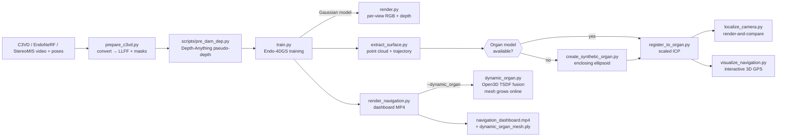

# 3DEndoMap — Surgical Navigation GPS on top of Endo-4DGS

3DEndoMap turns a monocular endoscopic video into a live **surgical GPS**: the
camera's position inside the organ, a growing 3D map of what has been
inspected, and clinical metrics (withdrawal time, pullback speed, coverage
percentage) rendered on a single dashboard.

Under the hood it builds on **Endo-4DGS** (MICCAI 2024) for dynamic scene
reconstruction via 4D Gaussian Splatting, adds a registration/localization
stack for placing the camera on an organ model, and — newest — a **dynamic
organ reconstruction** mode that grows the 3D organ mesh online via TSDF
fusion so nothing clinically shown was hallucinated.

> Note on status. This is a research codebase. The dashboard is a
> proof-of-concept; render-and-compare localization is not a substitute for
> SLAM, and the dynamic mesh is only as good as the trained Gaussian model's
> depth output. Don't use it for diagnosis.

---

## 1. What you get

| Feature | What it does |
|---|---|
| **Endo-4DGS training** | Learns a 4D (space + time) Gaussian representation of the endoscopic scene from a single video, supervised by Depth-Anything pseudo-depth. |
| **Surface + trajectory extraction** | Pulls the trained Gaussian point cloud and per-frame camera poses. |
| **Organ registration** | Scaled-ICP aligns the endoscopic reconstruction to a pre-operative organ mesh (CT/OBJ) or a synthesized enclosing organ. |
| **Render-and-compare localization** | For a query frame, picks the best-matching training-view render by SSIM and reports the pose in organ coordinates. |
| **Navigation dashboard** | Composites a per-frame MP4 with: reconstructed endoscopic view, depth map, and a large 3D GPS panel. HUD shows withdrawal time, pullback speed, path length, coverage %. |
| **Coverage heatmap** | Static-organ mode colors every organ surface point red → yellow → green based on whether the camera frustum has seen it. Highlights missed regions. |
| **Dynamic organ (TSDF fusion)** | New. No pre-op model required: the organ mesh is built live from per-frame rendered depth via a scalable TSDF volume. The map shows only anatomy that was actually observed. |

---

## 2. Architecture



Every script is deliberately standalone and takes its inputs from the
previous stage's outputs on disk, so you can re-run any step without rerunning
the ones before it.

---

## 3. Technologies

- **Endo-4DGS** — [paper](https://arxiv.org/abs/2401.16416). 4D Gaussian Splatting with a HexPlane-style deformation field. Code in `scene/` + `gaussian_renderer/`.
- **diff-gaussian-rasterization-depth** — differentiable rasterizer that also returns per-pixel depth (submodule).
- **Depth-Anything v1 (ONNX)** — monocular relative-depth prior for supervision; see `scripts/pre_dam_dep.py` and `submodules/depth_anything`.
- **Open3D** — TSDF fusion (`ScalableTSDFVolume`), ICP, mesh/point-cloud I/O and visualization.
- **PyTorch 2.0 + CUDA 11.8** — training & rendering.
- **OpenCV + Matplotlib** — dashboard compositing and 3D GPS rendering.
- **mmcv** — config file loading.

Datasets supported out of the box: **EndoNeRF**, **StereoMIS**, **C3VD**.

---

## 4. Repository layout

```
arguments/          dataset-specific configs (endonerf, stereomis, c3vd, …)
scene/              4DGS scene + dataset loaders + deformation (HexPlane)
gaussian_renderer/  differentiable render wrapper
submodules/         diff-gaussian-rasterization-depth, simple-knn, depth_anything
scripts/            one-off dataset utilities (pre_dam_dep.py, etc.)
utils/              graphics/IO/loss helpers
dynamic_organ.py    Open3D TSDF fusion wrapper (NEW)

prepare_c3vd.py     C3VD → EndoNeRF-format conversion
prepare_stereomis.sh / prepare_depth.sh

train.py            Endo-4DGS training loop
render.py           render test/train/video sets
metrics.py          PSNR / SSIM / LPIPS evaluation

extract_surface.py        Gaussian point cloud + camera trajectory
create_synthetic_organ.py synthesize an enclosing organ when no CT is available
register_to_organ.py      scaled ICP alignment to a pre-op organ
localize_camera.py        render-and-compare pose estimate for a query frame
visualize_navigation.py   interactive 3D GPS viewer (Open3D window)
render_navigation.py      MP4 dashboard: endo + depth + GPS + HUD  (NEW features)
run_navigation_demo.py    end-to-end demo over all test frames
```

---

## 5. Installation

Python 3.8, CUDA 11.8.

```bash
git clone --recurse-submodules <this repo>
cd 3DEndoMap
conda create -n ED4DGS python=3.8 && conda activate ED4DGS

pip install -r requirements.txt
pip install torch==2.0.0 torchvision==0.15.1 torchaudio==2.0.1 \
    --index-url https://download.pytorch.org/whl/cu118
pip install torchmetrics
pip install -e submodules/diff-gaussian-rasterization-depth
pip install -e submodules/simple-knn
```

Download [`depth_anything_vits14.onnx`](https://github.com/fabio-sim/Depth-Anything-ONNX/releases)
into `submodules/depth_anything/weights/`.

---

## 6. End-to-end pipeline

The flow below uses a C3VD colon phantom sequence; EndoNeRF/StereoMIS follow
the same shape (see `README_LEGACY` notes at the bottom).

### Step 1 — Convert the raw C3VD sequence

**Why:** Endo-4DGS expects EndoNeRF's LLFF layout (`images/`, `masks/`,
`poses_bounds.npy`). C3VD ships a different convention (per-line 4×4 poses,
mm depth, wide-FOV colonoscope) and needs:

- camera axis remap (C3VD +y-down → LLFF down/right/backwards)
- correct focal length (C3VD is ~140° hFOV; **not** the ~90° that was the
  legacy default — that was the main cause of collapsed trainings in early
  versions)
- near/far bounds auto-derived from the 16-bit GT depth PNGs
- **all-black** masks — the EndoNeRF loader interprets masks as *tool*
  masks and inverts them (white → ignored); C3VD has no tools, so mask
  should be 0 everywhere so every pixel is supervised.

**Command:**

```bash
python prepare_c3vd.py \
    --c3vd_dir dataset/trans_t1_b \
    --organ_model dataset/trans_model.obj \
    --output_dir data/endonerf/c3vd_trans_v2 \
    --hfov 140       # override if your calibration differs
```

Outputs: `images/`, `masks/`, `poses_bounds.npy`, `camera_trajectory.json`,
`organ_model.obj`, `c3vd_meta.json`.

### Step 2 — Generate pseudo-depth maps

**Why:** Endo-4DGS uses a relative monocular depth prior (Depth-Anything v1)
as a supervision signal in addition to RGB. Without `depth_dam/`, the
reconstruction has no depth cue and training struggles.

```bash
python scripts/pre_dam_dep.py \
    --dataset_root data/endonerf/c3vd_trans_v2 \
    --rgb_paths images
# Creates data/endonerf/c3vd_trans_v2/depth_dam/*.npy
```

### Step 3 — Train the 4D Gaussian model

**Why:** This is the main reconstruction step. Initialized from a per-frame
depth back-projection, the Gaussians deform across time via a HexPlane and
are supervised jointly by RGB, depth, and normal terms.

```bash
python train.py \
    -s data/endonerf/c3vd_trans_v2 \
    --model_path output/endonerf/c3vd_trans_v2 \
    --configs arguments/c3vd.py          # new C3VD config: 24k iters, longer densify
```

What to watch during training:

- **PSNR** on the tqdm bar should climb past ~22 dB by iter 3000 and keep
  rising; on EndoNeRF it usually plateaus ~30 dB, on C3VD a bit lower.
- `Loss=0.0 / PSNR=inf / SSIM=0` means **everything is being masked out** —
  regenerate the masks with `prepare_c3vd.py` (Step 1) so they're black.
- Checkpoints land under `output/.../point_cloud/iteration_NNNN/`.

### Step 4 — Render to verify

**Why:** confirms the Gaussian model actually reconstructs recognizable
tissue before you go on to build a dashboard on top of it.

```bash
python render.py \
    --model_path output/endonerf/c3vd_trans_v2 \
    --configs arguments/c3vd.py --skip_video --iteration 24000
# Look at output/.../test/ours_24000/renders/*.png
```

### Step 5 — Extract surface + trajectory (optional)

**Why:** produces the Gaussian point cloud and per-frame camera poses in
world coordinates — inputs for registration, static-organ coverage, and the
GPS viewer.

```bash
python extract_surface.py \
    --model_path output/endonerf/c3vd_trans_v2 \
    --configs arguments/c3vd.py --iteration 24000
# → surface_reconstruction/iteration_24000/{fused_pointcloud.ply, camera_trajectory.json}
```

### Step 6 — Register to an organ model (optional, static-organ path)

**Why:** gives you a "camera location on the organ" only if you have a
trustworthy pre-op mesh (CT/OBJ) and want to reuse it. For C3VD we use the
provided phantom mesh. If no pre-op model exists, skip this and use the
dynamic-organ dashboard (Step 7b).

```bash
python register_to_organ.py \
    --model_path output/endonerf/c3vd_trans_v2 \
    --iteration 24000 \
    --organ_mesh dataset/trans_model.obj
# → registered_endo_mesh.ply, registered_trajectory.json, registration_transform.json
```

Or synthesize an enclosing organ if you have no CT:

```bash
python create_synthetic_organ.py --model_path output/endonerf/c3vd_trans_v2
```

### Step 7a — Static-organ dashboard (coverage heatmap)

**Why:** full GPS with the classic flow: use the registered pre-op mesh,
overlay the camera path, and color the organ surface by what has been seen
(red = missed, green = covered).

```bash
python render_navigation.py \
    --model_path output/endonerf/c3vd_trans_v2 \
    --configs arguments/c3vd.py --iteration 24000
```

HUD on the GPS panel:

| Metric | Color logic |
|---|---|
| **Withdrawal MM:SS** | green once ≥ 6:00 (colonoscopy guideline) |
| **Speed mm/s** | green if 1–6 mm/s, red outside that window |
| **Path mm** | cumulative camera path length |
| **Coverage %** | green ≥ 80%, teal ≥ 50%, red below |

### Step 7b — Dynamic-organ dashboard (TSDF fusion, no pre-op mesh)

**Why:** the map is built from what was actually seen. Each frame's rendered
depth is integrated into an Open3D `ScalableTSDFVolume`; every
`--mesh_update_every` frames marching cubes extracts an up-to-date mesh that
replaces the organ on the GPS panel. Voxel size and depth bounds are
auto-derived from the rendered depth distribution (Gaussian depth is in
**normalized scene units, not mm**, so hardcoded mm values don't work).

```bash
python render_navigation.py \
    --model_path output/endonerf/c3vd_trans_v2 \
    --configs arguments/c3vd.py --iteration 24000 \
    --dynamic_organ \
    --mesh_update_every 15
# Output: navigation_dashboard.mp4  +  dynamic_organ_mesh.ply
```

In dynamic mode the HUD's coverage metric is replaced by the mesh size
(`Mesh NN,NNN pts (live TSDF fusion, M frames fused)`) because coverage and
mesh collapse into the same quantity — nothing that wasn't seen is in the
mesh.

### Step 8 — Render-and-compare localization (optional)

**Why:** a minimal proof-of-concept for "where am I now?" given a new
endoscopic frame. For every query frame, renders all training views and
picks the best SSIM match, then maps that pose into organ coordinates.

```bash
python localize_camera.py \
    --model_path output/endonerf/c3vd_trans_v2 \
    --configs arguments/c3vd.py --iteration 24000

python run_navigation_demo.py \
    --model_path output/endonerf/c3vd_trans_v2 \
    --configs arguments/c3vd.py --iteration 24000
```

Production would replace this with feature-matching (SuperPoint) or
pose regression — render-and-compare only validates the rest of the
pipeline end-to-end.

---

## 7. Dashboard panels, in detail

```
+-------------+--------------------------+
| ENDOSCOPIC  |                          |
|  VIEW       |        3D GPS            |
|  (Gaussian  |  ┌─ HUD ──────────────┐  |
|   render)   |  │ Withdrawal Time    │  |
+-------------+  │ Speed   Path       │  |
| DEPTH MAP   |  │ Coverage / Mesh    │  |
|  (per-frame │  └────────────────────┘  |
|   normalized)|                         |
+-------------+--------------------------+
```

- **Endoscopic view** — reconstructed RGB from the trained Gaussians, using
  the same pipeline `render.py` saves. If the render is essentially blank
  (undertrained checkpoint) the panel falls back to the ground-truth image
  and labels itself `(GT fallback)`.
- **Depth map** — per-frame 5th–95th-percentile normalization on valid
  pixels with an inverted Turbo colormap (near = warm, far = cool). A
  colorbar and per-frame min/max are overlaid.
- **3D GPS** — matplotlib 3D scatter of organ points (static or
  dynamic-TSDF). Camera path and current position are drawn on a centerline
  inferred via PCA. In static mode the organ is colored by coverage; in
  dynamic mode it shows the freshly-fused mesh.

---

## 8. Troubleshooting

| Symptom | Most likely cause | Fix |
|---|---|---|
| Training prints `Loss=0.0 / PSNR=inf / SSIM=0.0` | Masks are all-white and get inverted to all-zero by the EndoNeRF loader. | Re-run `prepare_c3vd.py` (now writes black masks), or manually overwrite `masks/*.png` with black images. |
| Renders in `ours_NNNN/renders/` are black/noise | hFOV default was 90°; C3VD needs ~140°. | Re-prep with `prepare_c3vd.py --hfov 140` and retrain from scratch (`rm -rf output/.../point_cloud`). |
| Dashboard endo panel is colorless / blurry | Undertrained checkpoint, or you rendered with `--iteration 3000` on a 12 000-iter model. | Train longer (`arguments/c3vd.py` uses 24 000) and pass the matching `--iteration`. |
| GPS panel is empty in dynamic mode | TSDF voxel too large relative to the normalized scene. | Let auto-scale handle it — don't pass `--voxel_size` explicitly, or pass something like `--voxel_size 0.01`. |
| Final dynamic mesh has <1 000 vertices | Rendered depth is too sparse — the Gaussians aren't covering the view. | Train longer or verify `render.py` gives dense renders first. |
| ONNX Runtime `pthread_setaffinity_np` warnings during pseudo-depth generation | Harmless — cgroup/affinity limits on the host. | Ignore, depths are still written correctly. |

---

## 9. Datasets

- **EndoNeRF** — request via the [Google form](https://docs.google.com/forms/d/e/1FAIpQLSfM0ukpixJkZzlK1G3QSA7CMCoOJMFFdHm5ltCV1K6GNVb3nQ/viewform).
- **StereoMIS** — [Zenodo](https://zenodo.org/records/7727692). Run `prepare_stereomis.sh` then organize as `data/stereomis/split_1/{images,poses_bounds.npy,...}`.
- **C3VD** — use `prepare_c3vd.py` as above. Expects `rgb/*_color.png`, `pose.txt` (16 floats per line, row-major 4×4 c2w), `depth/*.png` (16-bit, 0–100 mm), and an organ OBJ.

Final directory shape:

```
data/
├── endonerf/{pulling_soft_tissues,cutting_tissues_twice,c3vd_trans_v2,...}
│    └── images/ masks/ depth_dam/ poses_bounds.npy [organ_model.obj]
└── stereomis/split_1/images poses_bounds.npy ...
```

---

## 10. Related work (authors')

- [SurgTPGS](https://lastbasket.github.io/MICCAI-2025-SurgTPGS/) — Vision-Language Surgical 3D Scene Understanding.
- [Endo-4DGX](https://lastbasket.github.io/MICCAI-2025-Endo-4DGX/) — Robust Endoscopic Gaussian Splatting with Illumination Correction.
- [Endo-2DTAM](https://github.com/lastbasket/Endo-2DTAM) — Gaussian-Splatting SLAM for endoscopic scenes. (Natural successor to the dynamic-organ mode here.)

## 11. Citation

```
@inproceedings{huang2024endo,
  title={Endo-4dgs: Endoscopic monocular scene reconstruction with 4d gaussian splatting},
  author={Huang, Yiming and Cui, Beilei and Bai, Long and Guo, Ziqi and Xu, Mengya and Islam, Mobarakol and Ren, Hongliang},
  booktitle={International Conference on Medical Image Computing and Computer-Assisted Intervention},
  pages={197--207},
  year={2024},
  organization={Springer}
}
```

## 12. Acknowledgements

[StereoMIS](https://arxiv.org/abs/2304.08023v1) ·
[diff-gaussian-rasterization-depth](https://github.com/leo-frank/diff-gaussian-rasterization-depth) ·
[EndoNeRF](https://github.com/med-air/EndoNeRF) ·
[4DGaussians](https://github.com/hustvl/4DGaussians) ·
[Depth-Anything-ONNX](https://github.com/fabio-sim/Depth-Anything-ONNX).
